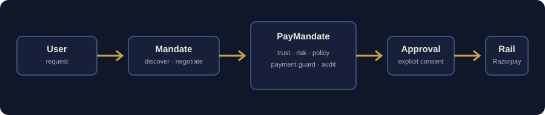

# PayMandate

**PayMandate is a safety and authorization layer for agentic commerce.** It lets a shopping agent discover and negotiate a deal while an independent backend decides whether that exact deal may be approved and sent to a payment rail.

The project answers a simple question: *how can an AI help someone buy something without becoming an unbounded financial actor?*



## Why it matters

An agent can misread a request, receive an unsafe seller offer, be influenced by malicious text, or retry a payment after an ambiguous network failure. PayMandate separates the shopping experience from financial authority:

```text
User → Mandate shopping agent → catalog / negotiation → PayMandate
                                                    ↓
                                  Trust · Risk · Policy · Decision
                                                    ↓
                              Explicit approval · Payment Guard · Audit
                                                    ↓
                                        Razorpay Test Mode / COD
```

The agent can propose. It cannot approve a purchase, alter the mandate, or execute a charge.

## Core capabilities

- Conversational shopping with bounded intent parsing and catalog-backed prices.
- Buyer Agent ↔ Merchant Agent negotiation with server-enforced price limits.
- Independent Trust, Risk, and Policy evaluation for every final deal.
- Explicit, amount-bound user approval and an OTP-protected mandate update flow.
- Payment Guard revalidation immediately before a payment attempt.
- Razorpay Test Mode checkout with server-side signature verification.
- Transaction-bound idempotency that prevents duplicate payment attempts.
- Receipt PDF, redacted audit PDF, timeline, read-only replay, and TEST-mode tracking.
- A practical Security Lab that exercises injection, price manipulation, stale deals, duplicate payments, permission violations, and recovery paths against the same backend controls.

## Quick start

### Requirements

- Node.js 20 or newer
- npm
- Razorpay Test Mode keys only if you want to exercise online checkout

### Run locally

```bash
git clone <your-repository-url>
cd paymandate
npm install
cp .env.example .env
npm run demo
```

Open [http://localhost:3000](http://localhost:3000).

The app remains usable without Gemini, RapidAPI, or Razorpay credentials. It falls back to deterministic local intent parsing and catalog data. Online checkout is intentionally unavailable until Razorpay Test Mode credentials are configured.

## Configuration

Create `.env` from `.env.example`. Never commit it.

```env
RAZORPAY_KEY_ID=rzp_test_...
RAZORPAY_KEY_SECRET=...

# Optional integrations
GEMINI_API_KEY=
GEMINI_MODEL=
RAPIDAPI_KEY=
RAPIDAPI_HOST=real-time-amazon-data.p.rapidapi.com
```

Use only `rzp_test_` credentials in this project. Test payments are simulated by Razorpay and do not debit a real card.

## Recommended demo path

1. Ask Mandate to find a product within a budget.
2. Select a catalog item or negotiate when offered.
3. Review the exact deal and explicitly approve it.
4. Provide delivery details and choose Cash on Delivery or Pay Online.
5. For online checkout, complete Razorpay Test Mode.
6. Open the receipt, audit PDF, tracking page, or Inspect views to review the evidence.

For the security demonstration, open **Inspect → Security** and run **Test duplicate-payment block**. It proves the backend refuses a second payment attempt; it never creates a charge.

## Quality checks

```bash
npm test
npm run demo:check
```

The suite covers the payment pipeline, negotiation rules, decision logic, security controls, deterministic fallback behavior, reliability boundaries, observability, conversation routing, checkout hardening, product experience, and end-to-end negotiation.

## Project layout

```text
src/
  server.js              HTTP API and orchestration
  decision/              canonical transaction decision
  trust/ risk/ policy/   independent evaluation engines
  security/              attack registry and execution harness
  observability/         audit, trace, replay, metrics, provenance
  runtime/               validation, state machine, payment idempotency
  demo/                  deterministic scenarios and health checks
public/                  browser application and static assets
data/                    local catalog and runtime data location
docs/                    architecture, security model, demo, API notes
test/                    semantic regression and end-to-end checks
```

## Documentation

- [Architecture](docs/ARCHITECTURE.md)
- [Security model](docs/SECURITY.md)
- [Demo guide](docs/DEMO.md)
- [API reference](docs/API.md)
- [Optional calibration utility](calibration/README.md)

## Scope and deployment notes

This repository is a local demonstration application. Runtime sessions and audit storage are local, and delivery tracking is clearly labelled as TEST-mode until a real courier integration is connected. Before production deployment, add durable storage, authentication, authorization boundaries for multi-user access, secrets management, webhook handling, monitoring, and a deployment-specific threat model.

## License

Private project submission. Add an explicit license before public distribution.
